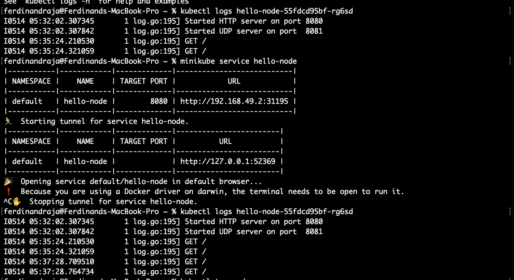

### Ferdinand Raja Kenedy - 2206046683
## Reflection on Hello Minikube

### 1. Compare the application logs before and after you exposed it as a Service. Try to open the app several times while the proxy into the Service is running. What do you see in the logs? Does the number of logs increase each time you open the app?

Every time I open the app, it triggers a log consist of GET method of HTTP protocol. It increase 2 times every time I open the app, this happen because there is a direct user interaction with the app.

### 2. Notice that there are two versions of `kubectl get` invocation during this tutorial section. The first does not have any option, while the latter has `-n` option with value set to `kube-system`. What is the purpose of the `-n` option and why did the output not list the pods/services that you explicitly created?
The -n option in kubectl get helps us specify which group of resources we want to see. When we add -n followed by a specific area, like kube-system, it only shows resources from that area. If we didn't see the pods or services we created when we ran kubectl get without -n, it's likely because they were made in a different area than the default one, so we'd need to specify that area using -n to see them.